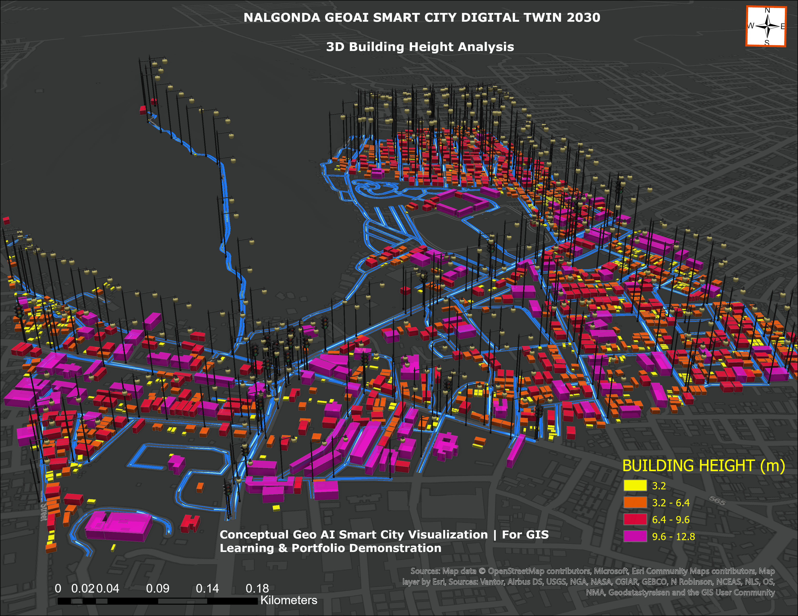
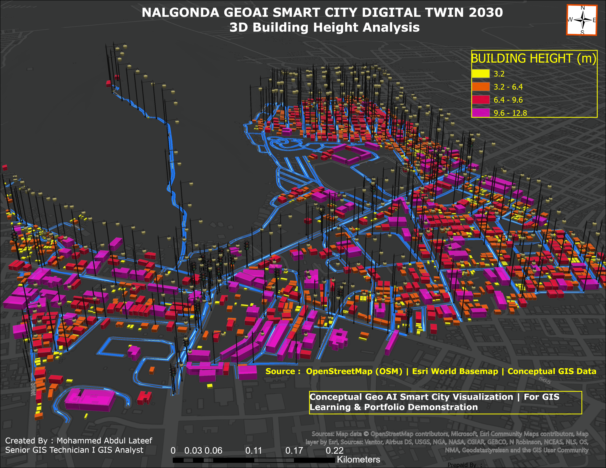
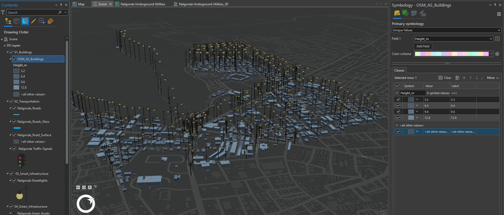
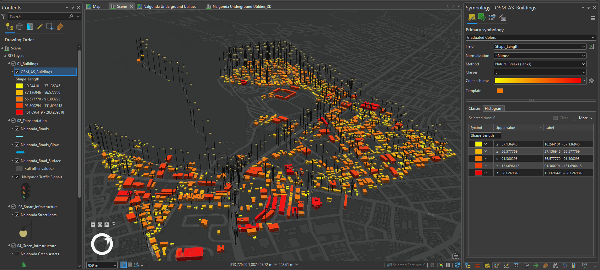
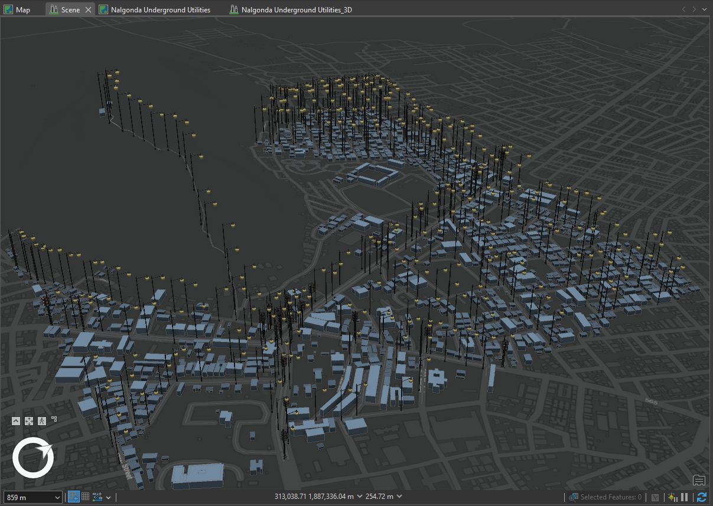

# 🌆 Nalgonda Smart City Digital Twin 2030

**Personal GIS Portfolio Project**

**3D GIS • Digital Twin • Smart Infrastructure • ArcGIS Pro • Spatial Analysis**

---

## 📌 Project Overview

Nalgonda Smart City Digital Twin 2030 is a Personal GIS Portfolio Project developed to demonstrate a practical 3D GIS workflow for smart-city and infrastructure visualization.

The project transforms a selected urban study area into a conceptual 3D Digital Twin by integrating buildings, road infrastructure, streetlights, underground utilities, terrain, drainage, water networks, power infrastructure, traffic signs, vegetation, and other urban assets within ArcGIS Pro.

The project demonstrates how multiple infrastructure datasets can be organized, visualized, and presented within a unified 3D GIS environment to support infrastructure understanding, asset visualization, planning, and smart-city applications.

---

## 🎯 Project Objectives

- Develop a structured Smart City GIS study area.
- Create and manage multiple infrastructure GIS layers.
- Develop a 3D urban environment using ArcGIS Pro.
- Visualize buildings and infrastructure assets in 3D.
- Integrate road, water, drainage, power, and utility networks.
- Create realistic streetlight and traffic-sign visualization.
- Apply terrain and elevation information to the 3D environment.
- Demonstrate underground utility visualization.
- Develop a professional night-time Smart City scene.
- Prepare the project for portfolio, web GIS, dashboard, and presentation workflows.

---

## 🗺️ GIS Layers & Smart Infrastructure

The Digital Twin environment includes:

### 🏢 Urban Development
- Buildings
- Road Surface
- Road Markings
- Study Area
- Terrain

### 💡 Smart Infrastructure
- Streetlights
- Traffic Signs
- Power Network
- Underground Utilities

### 💧 Utility Networks
- Water Network
- Drainage Network

### 🌳 Environment
- Trees and Vegetation
- Terrain / Elevation Surface

---

## 🔄 GIS Workflow

The project followed an end-to-end GIS workflow:

**Study Area Selection**  
↓  
**Spatial Data Preparation**  
↓  
**Building Extraction & Processing**  
↓  
**Road & Infrastructure Development**  
↓  
**Streetlight & Traffic Sign Creation**  
↓  
**Water, Drainage & Power Network Development**  
↓  
**Underground Utility Visualization**  
↓  
**Terrain & Elevation Integration**  
↓  
**3D Symbology & Extrusion**  
↓  
**Lighting & Night Scene Configuration**  
↓  
**3D Smart City Digital Twin Visualization**

---

## 🏢 Building Development

Building footprints were processed within the selected study area and prepared for 3D visualization.

The final project contains approximately **1,718 building features**, which were used to create the urban 3D environment.

Building extrusion and elevation settings were configured in ArcGIS Pro to represent the city environment within the Digital Twin scene.

---

## 💡 Smart Streetlight Network

A streetlight network was developed along the major road corridor.

Approximately **55 streetlight assets** were created and visualized using 3D symbology.

Streetlight visualization was further enhanced for the night-time scene to demonstrate smart infrastructure presentation within a Digital Twin environment.

---

## 🚦 Traffic & Road Infrastructure

The project includes:

- Road surface
- Road markings
- Traffic signs
- Streetlights
- Supporting transportation infrastructure

Approximately **21 traffic sign assets** were incorporated into the study area.

These layers help demonstrate how transportation assets can be integrated within a Smart City GIS environment.

---

## 🌐 Utility Network Visualization

Multiple infrastructure networks were incorporated into the Digital Twin environment, including:

- Water Network
- Drainage Network
- Power Network
- Underground Utilities

The underground infrastructure was visualized in 3D to demonstrate the relationship between above-ground and below-ground city assets.

---

## 🏔️ Terrain & 3D Environment

Terrain and elevation information were incorporated into the ArcGIS Pro scene to provide realistic ground representation.

3D visualization techniques included:

- Feature extrusion
- Base height configuration
- Real-world 3D symbols
- Terrain integration
- Scene lighting
- Night-time visualization
- Infrastructure positioning

---

## 🌙 Night-Time Digital Twin Visualization

A night-time Smart City visualization was developed to enhance the presentation of buildings, roads, streetlights, utilities, and other infrastructure assets.

Scene lighting and illumination settings were configured to create a professional Digital Twin presentation suitable for portfolio demonstration.

---

## 🛠️ Technologies Used

- **ArcGIS Pro**
- **ArcGIS 3D Scene**
- **3D GIS Visualization**
- **Spatial Analysis**
- **GIS Data Management**
- **3D Symbology**
- **Terrain & Elevation Analysis**
- **Infrastructure Asset Mapping**

---

## 🧠 Skills Demonstrated

This project demonstrates practical experience in:

- 3D GIS
- Digital Twin concepts
- Smart City GIS
- Infrastructure GIS
- Spatial data preparation
- Building extraction and visualization
- Utility network mapping
- Transportation asset mapping
- Terrain visualization
- 3D symbology
- Scene configuration
- GIS data management
- Professional GIS cartography and presentation

---

## 📊 Key Project Outputs

| Component | Output |
|---|---|
| Buildings | 1,718 |
| Streetlights | 55 |
| Traffic Signs | 21 |
| Road Infrastructure | Developed |
| Water Network | Developed |
| Drainage Network | Developed |
| Power Network | Developed |
| Underground Utilities | 3D Visualized |
| Terrain | Integrated |
| Final Environment | 3D Smart City Digital Twin |

---

## 🖼️ Project Screenshots

### 3D Building Height Analysis



### Smart City 3D Building Analysis



### Smart Infrastructure GIS Workflow



### 3D Digital Twin Night Visualization



### Final Smart City Digital Twin



---


## 📄 Project Case Study

A detailed case study covering the complete GIS workflow, smart infrastructure development, 3D building visualization, utility networks, terrain integration, and final Smart City Digital Twin is available below:

[📘 View Nalgonda Smart City Digital Twin 2030 Case Study](documentation/Nalgonda_Smart_City_Digital_Twin_2030_Case_Study.pdf)


---

## 📁 Repository Structure

```text
nalgonda-smart-city-digital-twin-2030/
|
├── documentation/     Project documentation and case study
├── maps/              Final map and visualization outputs
├── screenshots/       GIS workflow and 3D Digital Twin screenshots
├── scripts/           GIS automation scripts when applicable
└── README.md          Main project documentation
```

---

## 👤 Author

**Mohammed Abdul Lateef**

GIS Technician / GIS Analyst

Infrastructure GIS • ArcGIS Pro • ArcPy • 3D GIS • Digital Twin • Web GIS • GIS QA/QC

---

⭐ **Part of my Personal GIS Portfolio Project collection.**
